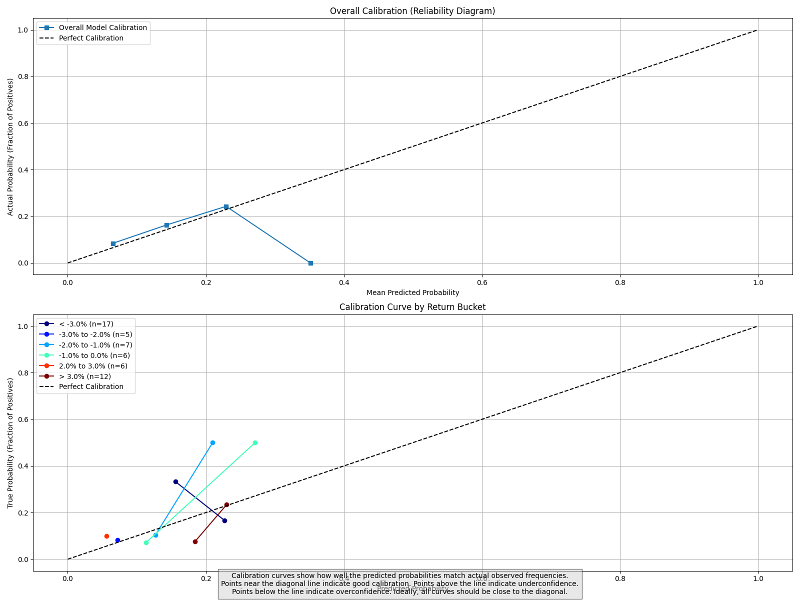

# Probabilistic Bucket Prediction for Stock Returns: Proof of Concept

This project is a **proof of concept** that demonstrates how to implement a probabilistic prediction approach for stock returns using XGBoost. Rather than attempting to predict exact stock prices (a notoriously difficult task), this system models the full probability distribution of future returns across discrete buckets.


## Concept & Experimental Status

This is an experimental implementation designed to explore the concept of probabilistic stock return prediction. It serves as a technical demonstration and learning resource for:

- Implementing probabilistic machine learning pipelines
- Working with time series financial data
- Creating proper backtesting frameworks
- Visualizing probability distributions and calibration

While the model shows promising aspects in probability calibration, the current version does not consistently outperform market benchmarks. This aligns with academic research showing the significant challenges in predicting short-term market movements.

## Key Features

- **Probabilistic approach**: Instead of point predictions, get full probability distributions across return ranges
- **Return buckets**: Returns are categorized into meaningful buckets (e.g., "large negative" to "large positive")
- **Feature engineering**: Comprehensive financial features based on price and volume history
- **Calibrated probabilities**: Uses advanced calibration techniques to ensure predicted probabilities match true frequencies
- **Evaluation metrics**: Uses proper scoring rules like log loss and Brier score to evaluate predicted probabilities
- **XGBoost model**: Leverages gradient boosting for efficient model training
- **Time-series validation**: Special validation approach that respects temporal ordering
- **Complete pipeline**: From data collection to backtesting framework

## Project Structure

- `src/`: Main module code
  - `data_loader.py`: Data loading and feature engineering
  - `model.py`: The ProbabilisticBucketPredictor implementation
  - `visualization.py`: Visualization utilities
  - `main.py`: CLI for running the model
- `simple_prediction.py`: Simple example script with synthetic data
- `simple_backtest.py`: Backtesting framework for model evaluation
- `models/`: Saved model files and visualizations
- `data/`: Directory for stock data

## Installation

```bash
# Create and activate a virtual environment (recommended)
python -m venv stockenv
source stockenv/bin/activate  # On Windows: stockenv\Scripts\activate

# Install dependencies
pip install -r requirements.txt
```

## Quick Start

### Running the Simple Example

```bash
python simple_prediction.py
```

This will:
1. Generate synthetic stock data
2. Engineer predictive features
3. Define return buckets
4. Train an XGBoost model with probability calibration
5. Evaluate the model
6. Make a prediction with probability distribution

### Training on Real Data

```bash
python -m src.main --ticker TSLA --mode train
```

### Making Predictions

```bash
python -m src.main --ticker TSLA --mode predict
```

### Running a Backtest

```bash
python simple_backtest.py --ticker TSLA --start 2019-01-01 --initial_train 500 --window 30
```

## Return Buckets

The system defines the following return buckets by default:

- Below -3%: Large negative return
- -3% to -2%: Medium negative return
- -2% to -1%: Small negative return
- -1% to 0%: Tiny negative return
- 0% to 1%: Tiny positive return
- 1% to 2%: Small positive return
- 2% to 3%: Medium positive return
- Above 3%: Large positive return

## Feature Engineering

The model uses a wide range of features engineered from historical price and volume data:

- Recent returns over different lookback periods (5, 10, 20, 30, 60 days)
- Rolling statistics (mean, std, max, min) of returns
- Momentum indicators comparing short vs long-term performance
- Volatility measures
- Volume indicators and changes
- Simple moving averages and cross-overs

## Evaluation Metrics

The model is evaluated using:

- **Log Loss**: Measures the quality of predicted probabilities
- **Brier Score**: Measures calibration quality
- **Directional Accuracy**: Ability to predict up/down direction
- **Strategy Returns**: Performance of trading strategy based on predictions

## Calibration Curves



Calibration curves show how well predicted probabilities match actual frequencies. Points near the diagonal line indicate good calibration.

## Experimental Findings

The backtesting framework provides valuable insights into probabilistic model performance. Initial experiments show:

1. **Calibration Quality**: The model effectively calibrates probabilities (predictions match observed frequencies)
2. **Directional Prediction**: Achieves directional accuracy slightly above random (~50-52%)
3. **Trading Strategy Gap**: This marginal predictive edge doesn't translate to outperformance vs buy-and-hold

These findings align with financial research suggesting market efficiency at short time horizons and demonstrate why sophisticated funds employ much more complex approaches including:

- Alternative data sources beyond price history
- Extremely low-latency infrastructure
- Advanced position sizing and risk management
- Ensemble methods across multiple timeframes

This prototype serves primarily as a technical demonstration of the prediction and backtesting methodology.

## Why Probabilistic Prediction?

Point forecasts of stock prices or returns are notoriously difficult and often misleading. A probabilistic approach acknowledges uncertainty and provides a range of possible outcomes with associated probabilities, which is much more valuable for decision-making in finance.

## Potential Extensions

This proof of concept could be extended in several ways for those interested in exploring probabilistic financial modeling further:

- **Advanced Features**: Add sentiment analysis, alternative data sources, sector correlations
- **Market Regimes**: Implement regime-switching models to adapt to changing market conditions
- **Risk Management**: Introduce Kelly criterion or other position sizing techniques
- **Ensemble Methods**: Combine predictions from multiple models at different timeframes
- **Inference Optimization**: Improve prediction speed for potential real-time applications
- **Explainability**: Add tools to better understand the drivers of specific predictions

These extensions would be necessary steps toward building an actual production system, though the efficient market hypothesis suggests that achieving consistent outperformance remains challenging.

## Contributing

Contributions are welcome! Please feel free to submit a Pull Request.

## License

This project is licensed under the MIT License - see the LICENSE file for details.